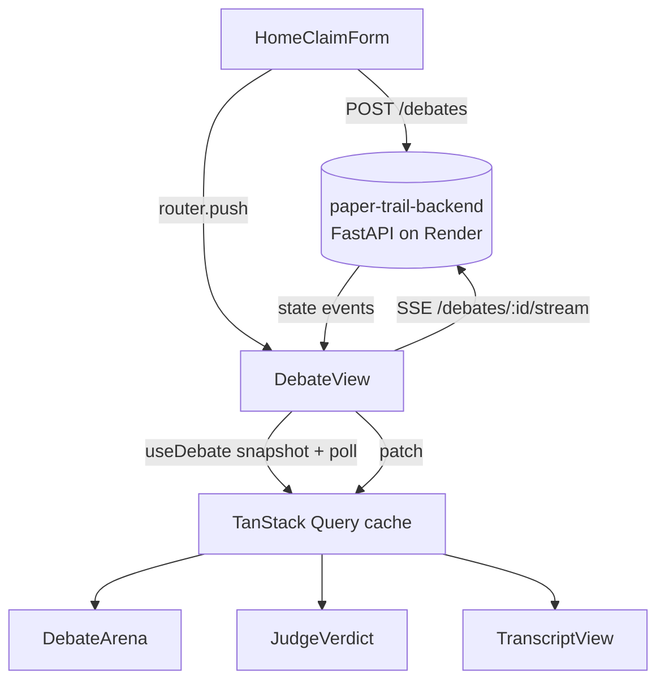
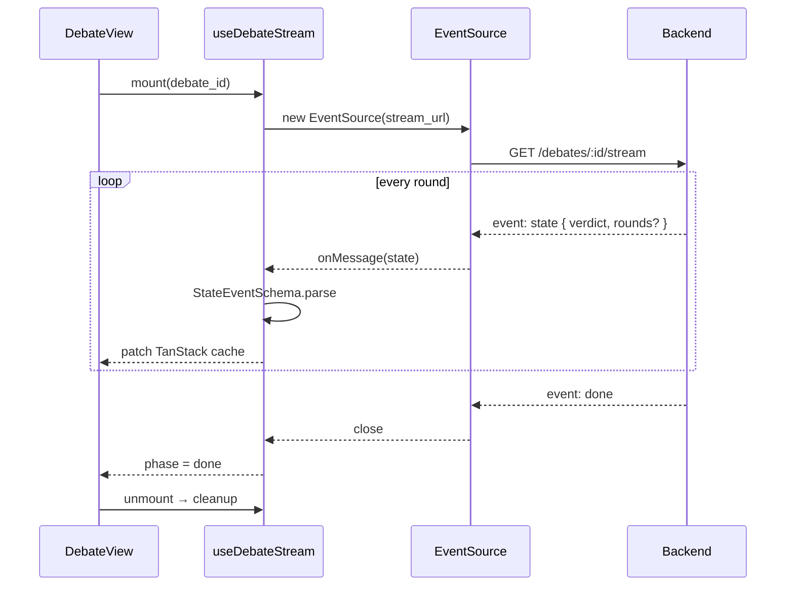

# 📰 `paper-trail-frontend`

> ⚡ **Next.js 16 UI for a LangGraph multi-agent debate arena.**
> Terminal-styled front-end. Live SSE streaming. Every verdict comes with a receipt.

🌐 [Backend API](https://paper-trail-backend-7h27.onrender.com) · 🔙 [Backend Repo](https://github.com/Abdul-Muizz1310/paper-trail-backend) · 🚀 [Quickstart](#-run-locally) · 🏗️ [Architecture](#️-architecture) · 🧪 [Testing](#-testing)


---

```console
$ pnpm dev
  ▲ Next.js 16.0.0 (Turbopack)
  - Local:   http://localhost:3000
  - API:     https://paper-trail-backend-7h27.onrender.com

[home]       claim input armed · backend status: warm ●
[debate]     SSE /debates/<id>/stream opened · 5 retries budget
[arena]      round 1 · proponent ● · skeptic ●
[judge]      confidence 0.91 · verdict FALSE · done ✓
[transcript] /debates/<id>/transcript rendered
```

---

## 🎯 What it is

The **paper-trail** front-end. Users type a claim; the UI spawns a debate on the FastAPI backend, subscribes to its **Server-Sent Events** stream, and renders two agents arguing in real time with inline citations. A judge renders its verdict and confidence live. The full markdown transcript is one click away — auditable, copyable, permalinked.

The whole app is wrapped in a **terminal-window aesthetic**: grid backgrounds, scanlines, status dots, monospace fonts, shell-path section headers. Dark mode only. No skeuomorphic chrome — just the feel of watching a pipeline run.

> 🔙 Backend: [`paper-trail-backend`](https://github.com/Abdul-Muizz1310/paper-trail-backend) — deployed at `paper-trail-backend-7h27.onrender.com`.

---

## ✨ Features

- 📡 Live SSE streaming of pro/con/judge rounds
- 🔁 Automatic reconnect with exponential backoff (5 retries, cap 8s)
- 🛟 Safety-net polling fallback (3s) while streaming
- 🛡️ Zod validation at every external boundary (API, env, SSE events)
- ⚡ TanStack Query cache patched in-place from SSE payloads (no refetch)
- ⌨️ Typewriter markdown rendering for live reveal
- 📝 Deterministic transcript view with judge reasoning extraction
- 💤 Backend health indicator with cold-start detection
- 🖥️ Terminal-style UI chrome (grid, scanlines, status dots)
- ⚛️ React 19 + React Compiler enabled

---

## 🏗️ Architecture



### 📡 SSE lifecycle



**Streaming model:** SSE is the primary transport. A 3-second polling fallback runs alongside as a safety net. When the backend inlines `rounds[]` in `state` events, the cache is patched directly — no refetch round-trip.

**Reconnect logic** ([`src/lib/sse.ts`](src/lib/sse.ts)): 5-retry budget, exponential backoff `min(500ms × 2^attempt, 8000ms)`. Terminated on `done`, `error: not_found`, or unmount. Terminal refs prevent stale closures; timers cleaned up on every path.

**Zod at every boundary:**
- 🌱 `env.ts` — validates `NEXT_PUBLIC_*` at import time
- 🌐 `api.ts` — `DebateSchema.parse()` / `DebateCreateOutSchema.parse()` on every fetch
- 📡 `sse.ts` — `StateEventSchema`, `DoneEventSchema`, `ErrorEventSchema` on every event

---

## 🗂️ Project structure

```
src/
├── app/
│   ├── page.tsx                      # Home: claim input + feature cards
│   ├── layout.tsx                    # Root layout + metadata
│   ├── providers.tsx                 # TanStack Query provider
│   ├── globals.css                   # Tailwind + terminal CSS (grid, scanlines)
│   ├── _home/
│   │   └── HomeClaimForm.tsx         # Client form container
│   └── debates/[id]/
│       ├── page.tsx                  # SSR wrapper (UUID validation)
│       ├── DebateView.tsx            # SSE orchestrator + cache sync
│       └── transcript/
│           ├── page.tsx              # SSR wrapper
│           └── TranscriptClient.tsx  # Markdown transcript viewer
├── components/
│   ├── DebateArena.tsx               # Two-column pro/con grid
│   ├── AgentPanel.tsx                # Per-agent rounds list
│   ├── EvidenceCard.tsx              # Citation card w/ quote + source
│   ├── JudgeVerdict.tsx              # Verdict + confidence + reasoning
│   ├── ConfidenceBar.tsx             # Animated confidence meter
│   ├── TypewriterMarkdown.tsx        # Animated markdown reveal
│   ├── TranscriptView.tsx            # Full markdown viewer
│   ├── ClaimInput.tsx                # Form + max-rounds control
│   ├── BackendStatus.tsx             # Cold / warm / down indicator
│   ├── terminal/                     # Terminal window, prompt, nav, status bar
│   └── ui/                           # shadcn primitives
└── lib/
    ├── env.ts                        # Runtime env validation (Zod)
    ├── api.ts                        # TanStack Query hooks + fetch
    ├── sse.ts                        # useDebateStream() EventSource hook
    ├── schemas.ts                    # Zod schemas + parseRounds/normaliseSide bridge
    ├── transcript.ts                 # extractJudgeReasoning()
    └── utils.ts                      # cn() (clsx + tailwind-merge)
```

> 📐 **Rule:** `app/` routes are thin. Components are dumb. All side effects live in `lib/`.

---

## 🛠️ Stack

| Concern | Choice |
|---|---|
| **Framework** | Next.js 16 (App Router, React Server Components, React Compiler) |
| **UI** | React 19 · TypeScript strict |
| **Styling** | Tailwind CSS v4 · shadcn/ui · radix-ui · lucide · Framer Motion |
| **State** | TanStack Query v5 · Zustand |
| **Validation** | Zod (env, API, SSE) |
| **Markdown** | react-markdown + remark-gfm |
| **Testing** | Vitest + Testing Library (unit) · Playwright (e2e) |
| **Lint / Format** | Biome (replaces ESLint + Prettier) |
| **Hosting** | Vercel |

---

## 🗺️ Routes

| Route | Purpose |
|---|---|
| `/` | 🏠 Home — claim input, feature cards, backend status |
| `/debates/[id]` | ⚔️ Live debate arena — SSE streaming pro/con/judge |
| `/debates/[id]/transcript` | 📜 Full deterministic markdown transcript |

---

## 🚀 Run locally

```bash
# 1. clone & install
git clone https://github.com/Abdul-Muizz1310/paper-trail-frontend.git
cd paper-trail-frontend
pnpm install

# 2. env
cp .env.example .env.local
# edit NEXT_PUBLIC_API_URL if backend runs elsewhere

# 3. dev
pnpm dev
# → http://localhost:3000
```

### 🌱 Environment

| Var | Purpose |
|---|---|
| `NEXT_PUBLIC_API_URL` | FastAPI backend base URL (SSE + REST) |
| `NEXT_PUBLIC_SITE_URL` | Public canonical URL (OG tags, absolute links) |

Validated at import time in [`src/lib/env.ts`](src/lib/env.ts) via Zod. Missing vars crash boot — **parse, don't validate**.

### 📜 Scripts

```bash
pnpm dev          # Next.js dev server
pnpm build        # production build
pnpm start        # production server
pnpm test         # Vitest unit tests
pnpm test:e2e     # Playwright e2e
pnpm lint         # Biome check
pnpm format       # Biome write
```

---

## 🧪 Testing

```bash
pnpm test                    # watch
pnpm test -- --run           # CI
pnpm test -- --coverage      # coverage report
pnpm test:e2e                # Playwright chromium
```

| Metric | Value |
|---|---|
| **Unit tests** | 165 tests (Vitest + jsdom) |
| **Line coverage** | **100%** |
| **E2E** | Playwright chromium, fixture `tests/e2e/fixtures/transcript.md` |
| **SSE suite** | Property suite P1–P6 + failure suite F1–F7 (14 cases: lifecycles, retries, cleanup, backoff) |
| **Methodology** | Red-first spec-TDD. Zod-validated discriminated unions instead of defensive runtime checks. |

---

## 📐 Engineering philosophy

| Principle | How it shows up |
|---|---|
| 🧪 **Spec-TDD** | SSE hook shipped with P1–P6 / F1–F7 test matrix before implementation landed. |
| 🛡️ **Negative-space programming** | Discriminated unions for `StreamPhase`, `BackendStatus`, `DebatePhase`. Malformed SSE events dropped silently. Unknown sides return `null` via `normaliseSide()`. |
| 🧬 **Parse, don't validate** | Zod at every edge: env, REST, SSE. No `any`, no unsafe casts, no optional-chain bug masks. |
| 🏗️ **Separation of concerns** | `app/` thin · `components/` dumb · `lib/` owns side effects. |
| 🔤 **Typed everything** | TS strict; Zod-inferred types flow end-to-end; no untyped dicts across module boundaries. |
| 🌊 **Pure core, imperative shell** | `parseRounds`, `extractJudgeReasoning`, schema transforms = pure. SSE + Query = imperative shell, isolated in `lib/`. |

---

## 🚀 Deploy

Hosted on **Vercel**. Push to `main` → Vercel build → preview URL → promote to prod.

Required env vars at build time:

- `NEXT_PUBLIC_API_URL`
- `NEXT_PUBLIC_SITE_URL`

Next config: `reactCompiler: true`.

---

## 📄 License

MIT. See [LICENSE](LICENSE).

---

> ⚡ **`paper-trail-ui --help`** · streaming debates, typed end-to-end
