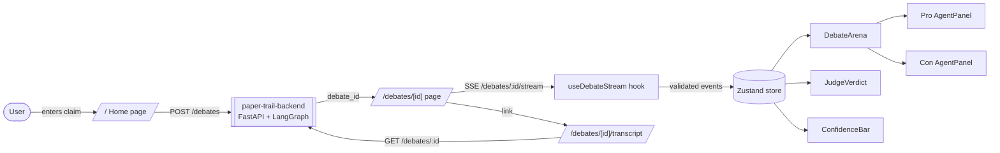
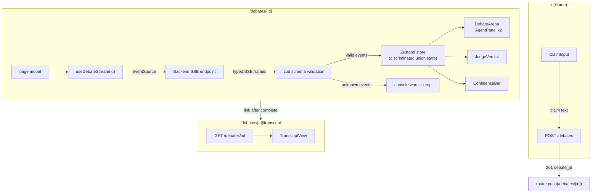
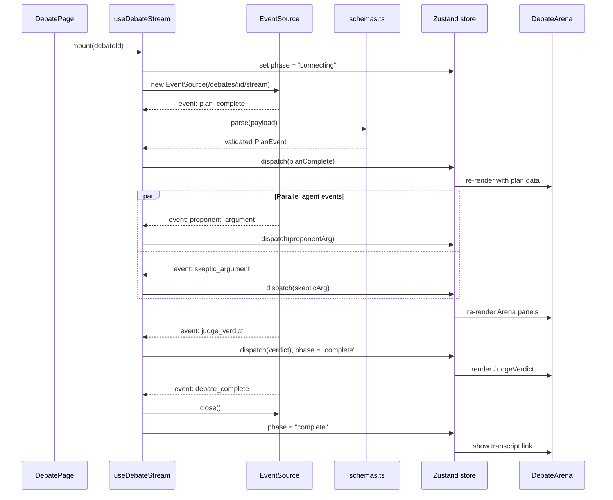

# Architecture

## Data flow overview

## Component map

| Layer | Files | Responsibility |
|---|---|---|
| **Pages** | `app/page.tsx`, `app/debates/[id]/page.tsx`, `app/debates/[id]/transcript/page.tsx` | Routing, server-side data fetching, layout composition |
| **Home widgets** | `app/_home/` | Co-located client components for the claim input page |
| **Components** | `AgentPanel`, `DebateArena`, `ClaimInput`, `ConfidenceBar`, `EvidenceCard`, `JudgeVerdict`, `TranscriptView`, `TypewriterMarkdown`, `BackendStatus` | Presentational components with typed props, loading + error states |
| **Terminal UI** | `components/terminal/` | Terminal-themed wrapper components for the debate aesthetic |
| **Hooks / state** | `lib/sse.ts` (SSE consumer with reconnect + backoff), `lib/store.ts` (Zustand) | Streaming event ingestion, client-side state management |
| **API client** | `lib/api.ts` | TanStack Query wrappers around REST endpoints, typed fetch helpers |
| **Validation** | `lib/env.ts` (env vars), `lib/schemas.ts` (wire payloads) | Zod schemas for runtime validation at every boundary |
| **Utilities** | `lib/transcript.ts`, `lib/utils.ts` | Transcript formatting, cn() classname helper |
| **UI primitives** | `components/ui/*` | shadcn/ui components (Button, Card, Skeleton, etc.) |

## Full data flow

## SSE lifecycle

## Invariants

1. **SSE payloads validated before store** -- every event passes through a zod discriminated union in `schemas.ts`. Unknown event types are logged and dropped, never rendered.
2. **Discriminated union state** -- the Zustand store models debate phase as `idle | connecting | streaming | complete | error`. Illegal transitions are unrepresentable; components pattern-match on phase.
3. **Env validated at import** -- `env.ts` throws at import time if required env vars (`NEXT_PUBLIC_API_URL`, etc.) are missing. No silent `undefined` leaking into fetch URLs.
4. **Typed props everywhere** -- all components receive explicitly typed props; no `any` crosses module boundaries.
5. **Server/client boundary** -- pages are server components that fetch initial data; interactivity lives in `"use client"` components and hooks.

## Testing architecture

| Layer | Tool | Pattern |
|---|---|---|
| **Component unit tests** | Vitest + jsdom + React Testing Library | `tests/components/*.test.tsx` -- render in isolation, assert on accessible roles and text content |
| **Hook / lib unit tests** | Vitest + jsdom | `tests/lib/*.test.ts` -- SSE tested via `FakeEventSource` mock, schemas tested with valid/invalid fixtures |
| **SSE hardening** | `FakeEventSource` (`tests/lib/fake-event-source.ts`) | Simulates event streams, connection drops, and malformed payloads without a real backend |
| **Schema hardening** | `tests/lib/schemas-hardening.test.ts` | Ensures zod schemas reject malformed payloads, unknown fields, and type mismatches |
| **E2E** | Playwright | `tests/e2e/debate-flow.spec.ts` -- full claim-to-verdict flow against a running backend |
| **Smoke** | Vitest | `tests/smoke.test.ts` -- basic import/render sanity check |

Test commands: `pnpm test` (Vitest unit + lib), `pnpm test:e2e` (Playwright).
